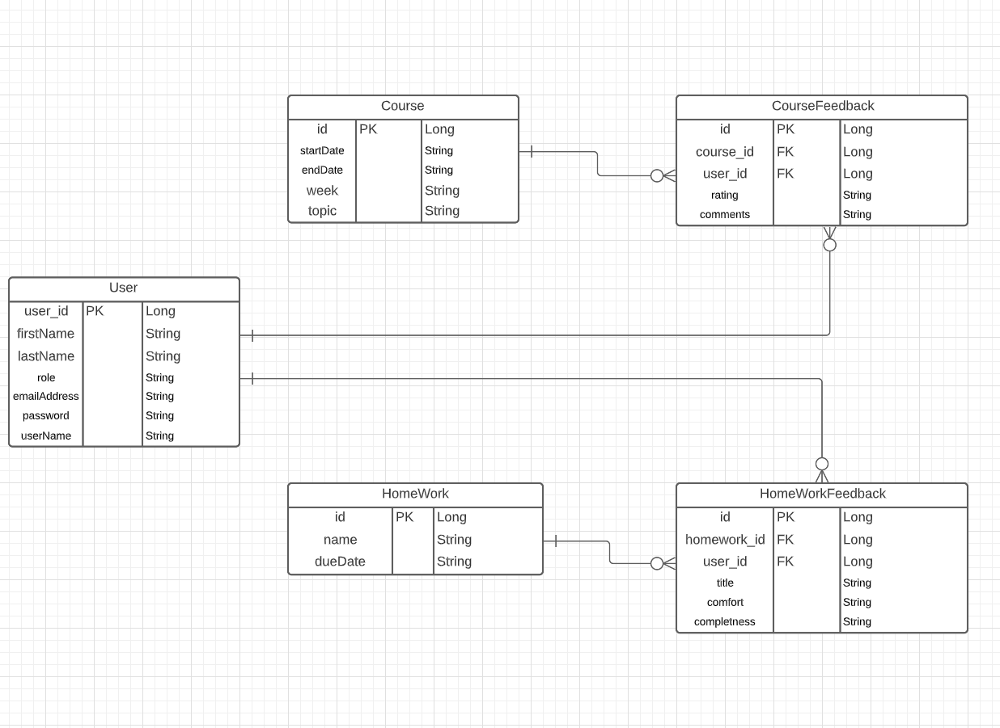

# Feedback_App

### Introduction

This App allows a user(student) to provide feedbacks for the daily class they are attending and everyday homework.

ER Diagram

### MVP

Our minimum viable product is a working database for:

- User, Course, CourseFeedback.
- All the models except User will have the four CRUD endpoints created using REST conventions.
- When invalid requests are made, the user will be notified by proper error messages.
- A user can register and login to perform various operations.
#### Bonus
- Add a working database for Homework, HomeworkFeedback models.

### User Stories

## User Model

- A user can register as a student or instructor
- A user can login
- A user can retrieve their data

## Course Model

- As a user(instructor), I should be able to create a course.
- As a user, I should be able to read a course.
- As a user(instructor), I should be able to update a course.
- As a user(instructor), I should be able to delete a course.

## Homework Model

- As a user(instructor), I should be able to create a homework.
- As a user, I should be able to read a homework.
- As a user(instructor), I should be able to update a homework.
- As a user(instructor), I should be able to delete a homework.

## Course Feedback Model

- As a user(student), I should be able to create feedback for a course.
- As a user(student), I should be able to update course feedback.
- As a user(student), I should be able to read feedback for a course.
- As a user(student), I should be able to delete feedback for a course.
- As a user(student), I should be able to see all my course feedbacks.
- As a user(instructor), I should be able to see feedback for a course by all students.

## Homework Feedback Model

- As a user(student), I should be able to create feedback for a homework.
- As a user(student), I should be able to update homework feedback.
- As a user(student), I should be able to read feedback for a homework.
- As a user(student), I should be able to delete feedback for a homework.
- As a user(student), I should be able to see all my homework feedbacks.
- As a user(instructor), I should be able to see feedback for a homework by all students.

## EndPoints

### User Auth endpoint

| Request Type | URL                 | Request Body               | Request Header               | Action          | Access  |
| ------------ | ------------------- | -------------------------- | ---------------------------- | --------------- | ------- |
| POST         | auth/users/register | user (instructor /student) |                              | register user   | public  |
| POST         | auth/users/login    | user login info            |                              | Login User      | public  |
| GET          | auth/users/profile  | none                       | Authorization : Bearer TOKEN | Retrieving user | private |

### Course endpoint

| Request Type | URL                   | Request Body   | Request Header               | Action                   | Access  |
| ------------ | --------------------- | -------------- | ---------------------------- | ------------------------ | ------- |
| GET          | api/courses           | none           | Authorization : Bearer TOKEN | get all courses          | private |
| GET          | api/course/{courseId} | none           | Authorization : Bearer TOKEN | get a specific course    | private |
| POST         | api/course            | course         | Authorization : Bearer TOKEN | create a course          | private |
| PUT          | api/course/{courseId} | partial course | Authorization : Bearer TOKEN | update a specific course | private |
| DELETE       | api/course/{courseId} | none           | Authorization : Bearer TOKEN | Delete a specific course | private |

### Course Feedback endpoint

| Request Type | URL                                   | Request Body            | Request Header               | Action                                                        | Access  |
| ------------ | ------------------------------------- | ----------------------- | ---------------------------- | ------------------------------------------------------------- | ------- |
| GET          | api/coursefeedback/course/{courseId}  | none                    | Authorization : Bearer TOKEN | get a specific course feedback                                | private |
| POST         | api//coursefeedback/course/{courseId} | course feedback         | Authorization : Bearer TOKEN | create a course feedback                                      | private |
| PUT          | api/coursefeedback/course/{courseId}  | partial course feedback | Authorization : Bearer TOKEN | Update a specific course feedback                             | private |
| DELETE       | api/coursefeedback/course/{courseId}  | none                    | Authorization : Bearer TOKEN | Delete course feedback                                        | private |
| GET          | api/coursefeedbacks                   | none                    | Authorization : Bearer TOKEN | get all course feedbacks submitted by _student_               | private |
| GET          | api/coursefeedbacks/course/{courseId} | none                    | Authorization : Bearer TOKEN | get all course feedbacks for a specific course _(instructor)_ | private |

### Homework endpoint

| Request Type | URL                       | Request Body     | Request Header               | Action                     | Access  |
| ------------ | ------------------------- | ---------------- | ---------------------------- | -------------------------- | ------- |
| GET          | api/homeworks             | none             | Authorization : Bearer TOKEN | get all homeworks          | private |
| GET          | api/homework/{homeworkid} | none             | Authorization : Bearer TOKEN | get a specific homework    | private |
| POST         | api/homework              | homework         | Authorization : Bearer TOKEN | create a homework          | private |
| PUT          | api/homework/{homeworkid} | partial homework | Authorization : Bearer TOKEN | update a specific homework | private |
| DELETE       | api/homework/{homeworkid} | none             | Authorization : Bearer TOKEN | Delete a specific homework | private |

### Homework Feedback endpoint

| Request Type | URL                                         | Request Body              | Request Header               | Action                                                            | Access  |
| ------------ | ------------------------------------------- | ------------------------- | ---------------------------- | ----------------------------------------------------------------- | ------- |
| GET          | api/homeworkfeedback/homework/{homeworkId}  | none                      | Authorization : Bearer TOKEN | get a specific homework feedback                                  | private |
| POST         | api/homeworkfeedback/homework/{homeworkId}  | homework feedback         | Authorization : Bearer TOKEN | create a homework feedback                                        | private |
| PUT          | api/homeworkfeedback/homework/{homeworkid}  | partial homework feedback | Authorization : Bearer TOKEN | update a specific homework feedback                               | private |
| DELETE       | api/homeworkfeedback/homework/{homeworkId}  | none                      | Authorization : Bearer TOKEN | Delete a specific homework feedback                               | private |
| GET          | api/homeworkfeedbacks                       | none                      | Authorization : Bearer TOKEN | get all homework feedbacks submitted by a _student_               | private |
| GET          | api/homeworkfeedbacks/homework/{homeworkId} | none                      | Authorization : Bearer TOKEN | get all homework feedbacks for a specific homework _(instructor)_ | private |

### Timeline
Day 1 |Day 2	|Day 3	|Day 4	|Day 5  |
| - | - | - | - | - |
Set up Spring Boot and Application Planning | Divided our work, Create models, start CRUD operations | Worked on Git Issue, Testing | Finish CRUD Operations, Fix dependencies | Worked Bonus task such as Homework, Homework Feedback|

### Bonus

- A user can see their profile
- A user(instructor) can see all the feedbacks for a course given by students
- A user(instructor) can see all the feedbacks for a homework given by students

### Hurdles

- Merging the code was the greatest hurdle for us
- Major setback was that only 1 machine has a database connectivity, which took most of the time in debugging issues
  when merging code.

### Wins

- Got confidence in working with Spring Boot Framework
- Learned how to customize Json response
- Learned a lot about git merging/rebase, creating branches, solving merge conflicts

### Future Implementations

- A user can see all the given feedbacks related to course and homework at same place
- A user can update their profile
- Add unit tests
- Allow a user to update their password, profile

### Technologies Used

- Lucidchart - to create the ERD
- IntelliJ
- Spring Boot
- Maven
- pgAdmin
- postgres
- Postman - used to test our end points
- JWT - used as security for user login

### Installation Instructions

- Fork and clone the repository.
- Using postgres, create a database called myfeedbackapp
- Open the file Feedback_app/src/main/resources/application-dev.properties and change lines 2 to the
  proper port number (9092 recommended) and 4 & 5 to be your postgres username and password

### Resources

- [git rebase] (https://www.w3docs.com/snippets/git/how-to-rebase-git-branch.html)
- Lesson videos
